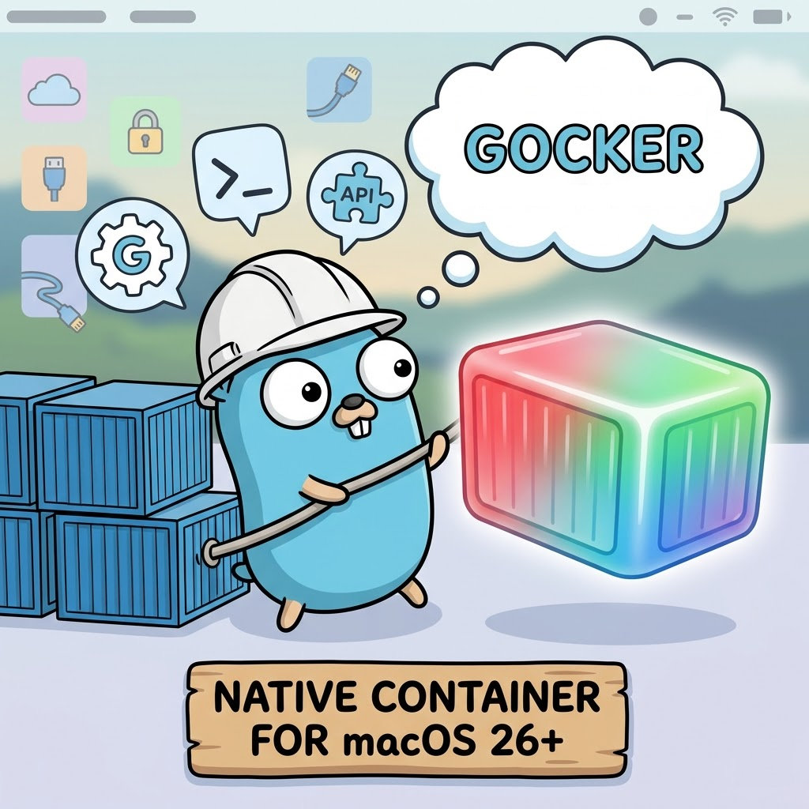

<p align="center">
    
</p>

# gocker

Docker-compatible CLI and API daemon for [Apple Container](https://github.com/apple/container) on macOS 26+. Also runs natively on Linux via containerd/nerdctl.

Every container runs as a lightweight Linux microVM backed by Apple's `Virtualization.framework` — hardware-level isolation, not just namespaces.

## Why gocker?

| | Docker Desktop | gocker |
|---|---|---|
| **How it works** | Runs a hidden Linux VM, then runs containers inside it | Each container *is* its own lightweight VM — native on Apple Silicon |
| **Setup** | Download installer, sign in, allocate resources | `gocker setup` — one command, done |
| **CLI** | `docker run`, `docker ps`, ... | Same commands — just swap `docker` for `gocker` |
| **Compose** | `docker compose up` | `gocker compose up` — same compose files |
| **AI sandboxing** | `docker sandbox` — requires Docker Desktop | `gocker sandbox run claude ./` — native, no Docker needed |
| **Tooling** | Portainer, lazydocker, Testcontainers | Same tools — gocker exposes a Docker-compatible API |
| **Overhead** | Docker Desktop daemon, ~2GB RAM idle | Single static binary, no background daemon required |
| **Binary size** | ~60MB CLI + ~2GB app bundle | ~10MB standalone binary |
| **Isolation** | Process-level (namespaces/cgroups) | Hardware-level (Apple Virtualization.framework) |
| **Linux support** | Docker Engine | gocker + nerdctl (same CLI, same behavior) |
| **License** | Proprietary (free tier) | Apache 2.0 (fully open source) |

## Requirements

- macOS 26+ (Tahoe) on Apple Silicon, **or** Linux with containerd + nerdctl
- Apple's `container` CLI (macOS) — installed automatically via `gocker setup`

## Install

```bash
# Homebrew (recommended)
brew tap lunguini/tap
brew install gocker

# Or with Go
go install github.com/lunguini/gocker@latest
```

## Getting Started

```bash
# Check prerequisites and install Apple Container if needed
gocker setup

# Run a container
gocker run ubuntu:latest echo "hello from a microVM"

# Run an interactive container
gocker run -it ubuntu:latest /bin/bash
```

## Usage

gocker mirrors Docker's CLI interface:

```bash
gocker run -d --name web -p 8080:80 nginx     # Run in background
gocker ps                                       # List containers
gocker logs web                                 # View logs
gocker exec -it web /bin/sh                     # Exec into container
gocker stop web                                 # Stop container
gocker rm web                                   # Remove container
```

Images, networks, and volumes work the same way:

```bash
gocker pull ubuntu:latest
gocker images
gocker network create mynet
gocker volume create mydata
```

Use `--format json` on any command for JSON output.

## Compose

Run multi-container applications with standard `docker-compose.yml` files:

```bash
gocker compose up                 # Start all services
gocker compose up -d              # Start in background
gocker compose ps                 # List service containers
gocker compose logs               # View all logs
gocker compose logs api           # View logs for one service
gocker compose restart redis      # Restart a service
gocker compose down               # Stop and remove everything
gocker compose down -v            # Also remove volumes
```

Supports `-f <file>` for custom compose file paths and `-p <name>` for project name override.

## AI Agent Sandboxing

The killer feature. Run AI agents in hardware-isolated microVMs with host configs synced automatically:

```bash
# Run Claude Code in a sandbox (mounts current dir as /workspace)
gocker sandbox run claude ./

# Run with a custom name
gocker sandbox run claude ./ --name my-project

# Run in background
gocker sandbox run claude ./ -d

# Manage sandboxes
gocker sandbox ls
gocker sandbox attach my-project
gocker sandbox logs my-project
gocker sandbox stop my-project
gocker sandbox rm my-project
```

Sandboxes automatically:
- Mount your workspace into the VM
- Sync host Claude settings (plugins, marketplaces) with sandbox-safe defaults
- Sync Claude Code sessions — `/resume` works across host and sandbox
- Forward `ANTHROPIC_API_KEY` from your environment
- Allocate 4GB memory for Claude Code

Session sync can be disabled in `~/.gocker/config.yaml`:

```yaml
sandbox:
  syncClaudeSession: false
```

## Isolation Modes

Configure how containers are isolated via `~/.gocker/config.yaml`:

```yaml
isolation: hybrid  # full | hybrid | shared
```

| Mode | Behavior |
|------|----------|
| `full` | Every container is its own microVM (default, maximum isolation) |
| `hybrid` | Compose and run share a persistent VM; sandboxes always get dedicated microVMs |
| `shared` | Everything in one VM (most resource-efficient, container-level isolation only) |

Override per-command: `gocker --isolation full compose up`

## Docker API & Portainer

gocker includes a Docker-compatible REST API daemon. Existing Docker tools like Portainer, lazydocker, and Testcontainers work out of the box.

### Portainer setup

```bash
# Start the gocker API daemon
gocker daemon start

# Create volume and run Portainer
gocker volume create portainer_data
gocker run -d -p 9443:9443 --name portainer -v ~/.gocker/gocker.sock:/var/run/docker.sock -v portainer_data:/data portainer/portainer-ce:sts

# Open https://localhost:9443
```

> **Note:** Mount `~/.gocker/gocker.sock` (not `/var/run/docker.sock`) as the host-side socket path. The container-side path stays `/var/run/docker.sock` since that's where tools expect it.

### Daemon management

```bash
gocker daemon start          # Start API daemon
gocker daemon stop           # Stop API daemon
gocker daemon status         # Show daemon + shared VM status
gocker daemon vm status      # Shared VM status (hybrid/shared modes)
gocker daemon vm stop        # Stop the shared VM
```

## AI Agent Integration

Get a complete CLI reference optimized for AI agents — every command, flag, and example in one output:

```bash
gocker ai
```

This outputs a structured reference that agents can consume directly, plus workspace context (detected compose files, running containers, Dockerfiles). Pipe it into a system prompt, paste it into CLAUDE.md, or let your agent call it at the start of a session.

```bash
# Add to a project's CLAUDE.md
gocker ai >> CLAUDE.md

# Use in a prompt
gocker ai | claude --prompt "help me set up a postgres + redis stack"
```

## Migrating from Docker

Most Docker commands work by replacing `docker` with `gocker`:

```bash
# Docker                                    # gocker
docker run -d -p 80:80 nginx                gocker run -d -p 80:80 nginx
docker compose up -d                        gocker compose up -d
docker ps                                   gocker ps
docker exec -it myapp sh                    gocker exec -it myapp sh
docker build -t myimg .                     gocker build -t myimg .
```

### Known differences

| Docker flag | gocker behavior |
|-------------|-----------------|
| `--restart=always` | Accepted with warning (not supported by Apple Container CLI) |
| `-v /var/run/docker.sock:...` | Use `-v ~/.gocker/gocker.sock:...` instead |
| `docker login` | Use `container registry login` directly |

### Socket path

Docker tools expect a socket at `/var/run/docker.sock`. With gocker, set `DOCKER_HOST` to point to the gocker socket:

```bash
export DOCKER_HOST=unix://$HOME/.gocker/gocker.sock
```

Or mount the gocker socket when running tools that need it:

```bash
-v ~/.gocker/gocker.sock:/var/run/docker.sock
```

## Shell Completions

```bash
# Bash
gocker completion bash >> ~/.bashrc

# Zsh
gocker completion zsh >> ~/.zshrc

# Fish
gocker completion fish > ~/.config/fish/completions/gocker.fish
```

## Benchmarks

Compare gocker vs Docker Desktop performance:

```bash
make benchmark
```

Measures container startup time, image pull speed, `ps` latency, memory overhead, and binary size. Results are averaged over multiple runs. Only compares against Docker if it's installed — otherwise shows gocker results only.

## Building

```bash
make build          # Build the binary
make build-linux    # Cross-compile for Linux/arm64
make install        # Build and install to /usr/local/bin
make test           # Run tests
make lint           # Run linter
make smoke          # End-to-end smoke test
make benchmark      # Performance comparison vs Docker Desktop
```

### Template Images

```bash
make template-push-claude   # Build and push Claude sandbox image
make template-push-base     # Build and push gocker-base shared VM image
make template-push          # Build and push all template images
```

## Roadmap

- [x] Core container commands (`run`, `ps`, `stop`, `rm`, `exec`, `logs`, `inspect`, `start`)
- [x] Image management (`pull`, `push`, `images`, `rmi`, `build`)
- [x] Network management (`network create/ls/rm/connect/disconnect`)
- [x] Volume management (`volume create/ls/rm/inspect`)
- [x] Docker REST API daemon on Unix socket (`gocker daemon start`)
- [x] AI sandbox — `gocker sandbox run claude ./` with config sync
- [x] Auto-setup (`gocker setup` installs Apple Container CLI)
- [x] Template images published to Docker Hub
- [x] `gocker compose up/down/ps/logs/restart` with standard docker-compose.yml
- [x] Smoke test suite (`make smoke`) for end-to-end CLI validation
- [x] Golden file parser tests for Apple CLI output format changes
- [x] Configurable VM isolation modes (`full`, `hybrid`, `shared`) with shared VM support
- [x] Config file support (`~/.gocker/config.yaml`)
- [x] Cross-platform runtime: Apple Container (macOS) + nerdctl (Linux)
- [x] Shell completions (`gocker completion bash/zsh/fish`)
- [x] Gocker-base image for shared VM (`make template-push-base`)
- [x] Docker API compatibility (Portainer, lazydocker, Testcontainers)
- [x] Performance benchmarks (`make benchmark`)
- [x] AI agent CLI reference (`gocker ai`)
- [x] Claude Code session sync across host and sandbox (`/resume` works)
- [x] GoReleaser + GitHub Actions release workflow
- [x] Homebrew formula (`brew tap lunguini/tap && brew install gocker`)
- [ ] Network policy enforcement (`--network-policy deny --allow-host api.anthropic.com`)
- [ ] Codex and Gemini sandbox templates

## License

Apache 2.0
